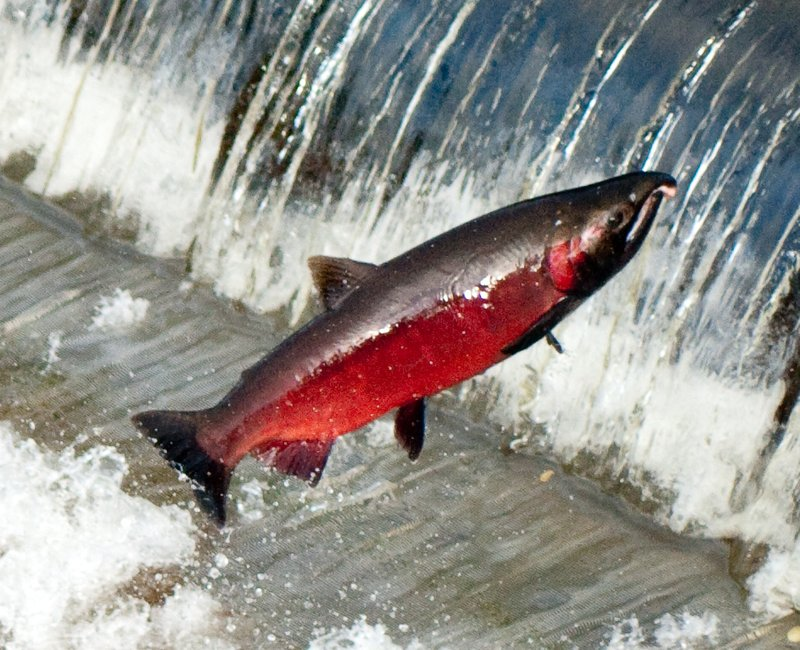
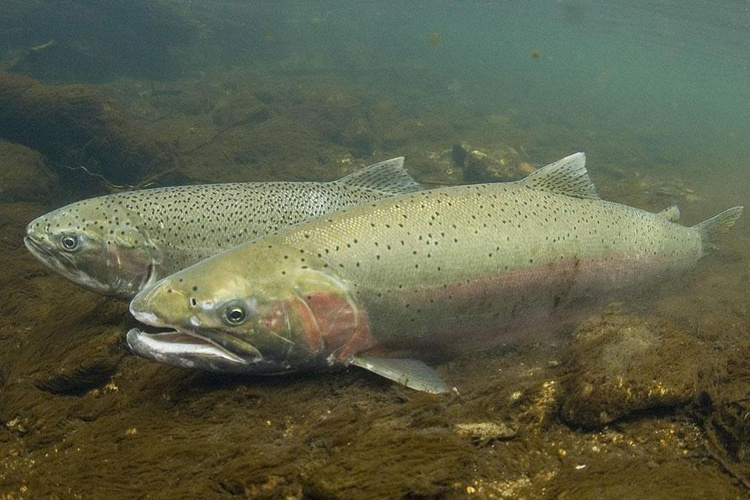

# Introduction {.tabset .tabset_pills}

This report explores time series data from the Willamette Falls fish ladder passage on the Willamette River in Oregon. The data used in this analysis are from the Columbia River Data Access in Real Time (DART) and collected by the Oregon Department of Fish and Wildlife (ODFW). Counts of fish species were gathered at the fish ladder using video cameras to record data 24/7. This analysis focuses on coho (*Oncorhynchus kisutch*), jack coho, and steelhead (*Oncorhynchus mykiss*) salmon between 2001 and 2010. "Jack" coho salmon are males that reach sexual maturation and return to spawn in freshwater one year earlier than full-size adult males. 

**Data source:** Columbia Basin Research, University of Washington. 2023. DART Adult Passage Graphics & Text. http://www.cbr.washington.edu/dart/query/adult_graph_text

```{r setup, include=TRUE, message = FALSE, warning = FALSE}
knitr::opts_chunk$set(echo = TRUE, message = FALSE, warning = FALSE)

library(tidyverse)
library(janitor)
library(here)
library(lubridate)
library(tsibble)
library(fable)
library(feasts)
library(cowplot)
library(calecopal)
```

#### {.tabset .tabset_pills}

##### Study site


##### Coho salmon



##### Steelhead



# Time series analysis and visualizations {.tabset .tabset_pills}

## Original time series 

### Daily fish counts by species

```{r}
## reading in and cleaning up the data
fish <- read_csv(here("data/willamette_fish_passage.csv")) %>% 
  clean_names() %>% 
  ## including only our 3 fish types of interest
  select(date, steelhead, coho, jack_coho) %>% 
  ## replacing NA values with 0
  replace(is.na(.), 0) %>% 
  ## converting date column to date class
  mutate(date = mdy(date)) %>% 
  ## converting data frame to a tsibble
  as_tsibble(key = NULL, index = date)

## creating a longer df with single observations for each fish species
fish_longer <- fish %>% 
  pivot_longer(cols = 2:4, names_to = "species", values_to = "count") %>% 
  mutate(species = case_when(
    species == "coho" ~ "Coho",
    species == "jack_coho" ~ "Jack Coho", 
    species == "steelhead" ~ "Steelhead"))

## creating subsets of the tsibble df by species to plot separately for enhanced plot customization
coho <- fish_longer %>% 
  filter(species == "Coho")

jack <- fish_longer %>% 
  filter(species == "Jack Coho")

steelhead <- fish_longer %>% 
  filter(species == "Steelhead")

## plotting coho time series plot of daily fish counts
coho_plot <- ggplot(data = coho, aes(x = date, y = count, color = species)) +
  geom_line() +
  facet_wrap(~species) +
  labs(x = element_blank(), 
       y = element_blank()) +
  ylim(0, 1300) +
  scale_x_date(limits = as.Date(c('2001-01-01', '2010-12-31')),
               date_breaks = "1 year",
               date_labels = "%Y") +
  scale_color_manual(values = "salmon") +
  theme_bw() +
  theme(
    axis.title = element_text(face = "bold"),
    panel.grid.minor.y = element_blank(),
    strip.text = element_text(face = "bold"),
    strip.background = element_rect(fill = "salmon"),
    legend.position = "none"
  )

## plotting jack coho time series plot of daily fish counts
jack_plot <- ggplot(data = jack, aes(x = date, y = count, color = species)) +
  geom_line() +
  facet_wrap(~species) +
  labs(x = element_blank(), 
       y = "Daily fish count") +
  ylim(0, 1300) +
  scale_x_date(limits = as.Date(c('2001-01-01', '2010-12-31')),
               date_breaks = "1 year",
               date_labels = "%Y") +
  scale_color_manual(values = "darksalmon") +
  theme_bw() +
  theme(
    axis.title = element_text(face = "bold"),
    panel.grid.minor.y = element_blank(),
    strip.text = element_text(face = "bold"),
    strip.background = element_rect(fill = "darksalmon"),
    legend.position = "none"
  )

## plotting jack coho time series plot of daily fish counts
steelhead_plot <- ggplot(data = steelhead, aes(x = date, y = count, color = species)) +
  geom_line() +
  facet_wrap(~species) +
  labs(x = element_blank(), 
       y = element_blank()) +
  ylim(0, 1300) +
  scale_x_date(limits = as.Date(c('2001-01-01', '2010-12-31')),
               date_breaks = "1 year",
               date_labels = "%Y") +
  scale_color_manual(values = "aquamarine3") +
  theme_bw() +
  theme(
    axis.title = element_text(face = "bold"),
    panel.grid.minor.y = element_blank(),
    strip.text = element_text(face = "bold"),
    strip.background = element_rect(fill = "aquamarine3"),
    legend.position = "none"
  )

## combining plots using cowplot
plot_grid(coho_plot, jack_plot, steelhead_plot,
          align = "v",
          ncol = 1)
```

**Figure 1** displays daily fish counts for coho, jack coho, and steelhead salmon from 2001 through 2010 at the Willamette Falls fish ladder. 

**Takeaways:**

- Steelhead have a higher abundance than coho and jack coho at Willamette Falls, although there were notable spikes in Coho observations in 2009 and 2010
- Steelhead populations have remained fairly stable from 2001 to 2010, while coho populations appear to be increasing
- There is seasonal variation in when each salmon species passes through the fish ladder


## Seasonplots

### Seasonal trends in fish counts

```{r}

## making season plots for each salmon species
coho_seasonplot <- coho %>% 
  gg_season(y = count,
            pal = cal_palette("bigsur")) +
  facet_wrap(~species, strip.position = "top") +
  labs(x = element_blank(),
       y = element_blank()) +
  theme_bw() +
  scale_x_date(date_breaks = "1 month",
               date_labels = "%b") +
  ylim(0, 1300) +
  theme(
    axis.title = element_text(face = 'bold'),
    panel.grid.minor.y = element_blank(),
    strip.text = element_text(face = 'bold'),
    strip.background = element_rect(fill = 'salmon'),
    legend.position = "none"
  )

jack_seasonplot <- jack %>% 
  gg_season(y = count,
            pal = cal_palette("bigsur")) +
  facet_wrap(~species, strip.position = "top") +
  labs(x = element_blank(),
       y = element_blank()) +
  theme_bw() +
  scale_x_date(date_breaks = "1 month",
               date_labels = "%b") +
  ylim(0, 1300) +
  theme(
    axis.title = element_text(face = 'bold'),
    panel.grid.minor.y = element_blank(),
    strip.text = element_text(face = 'bold'),
    strip.background = element_rect(fill = 'darksalmon'),
    legend.position = "none"
  )

steelhead_seasonplot <- steelhead %>% 
  gg_season(y = count,
            pal = cal_palette("bigsur")) +
  facet_wrap(~species, strip.position = "top") +
  labs(x = element_blank(),
       y = element_blank()) +
  theme_bw() +
  scale_x_date(date_breaks = "1 month",
               date_labels = "%b") +
  ylim(0, 1300) +
  theme(
    axis.title = element_text(face = 'bold'),
    panel.grid.minor.y = element_blank(),
    strip.text = element_text(face = 'bold'),
    strip.background = element_rect(fill = 'aquamarine3'),
    legend.position = "none"
  )

## combing the three seasonplots using cowplot
seasonplot <- plot_grid(coho_seasonplot, jack_seasonplot, steelhead_seasonplot,
          align = "v",
          ncol = 1)

## making a y axis label for the combined plot
plot_labs <- ggdraw() +
  draw_label(
    "Daily fish count",
    fontface = "bold",
    angle = 90) 

## storing a legend to add to the combined plot
combined_legend <- get_legend(coho_seasonplot +
                                theme(legend.position = "right"))

## adding the y axis label and legend to the combined plot
plot_grid(plot_labs, seasonplot, combined_legend,
          ncol = 3, 
          rel_widths = c(0.07, 1, 0.15),
          axis = "tbl")
```

**Figure 2** shows monthly trends in salmon observations at the Willamette Falls fish ladder by species. Each line represents a single year of data from 2001 to 2010. 

**Takeaways:**

- There are clear seasonal trends in salmon observations at the fish ladder:
  - Coho and jack coho are present during a small window, with most observations coming in September and October
  - Steelhead passage occurs over a longer duration, with most observations coming between January and August

## Yearly totals

### Counts of fish species by year


```{r}
## creating a new df with annual total counts by species
fish_counts_yearly <- fish_longer %>% 
  index_by(year = ~year(.)) %>% 
  group_by(species) %>% 
  summarize(yearly_counts = sum(count))

## visualizing annual fish counts
ggplot(data = fish_counts_yearly, aes(x = year, y = yearly_counts)) +
  geom_line(size = 1, aes(color = species)) +
  theme_bw() +
  scale_color_manual(values = c("salmon", "darksalmon", "aquamarine3")) +
  theme(legend.title = element_blank()) +
  labs(x = element_blank(),
       y = "Annual fish counts") +
  scale_x_continuous(breaks = seq(from = 2001, to = 2010, by = 1),
                     expand = c(0,0)) +
  theme(
    axis.title.y = element_text(face = 'bold', vjust = 2),
    axis.text.x = element_text(face = 'bold'))
```

**Figure 3** displays total counts of coho (red), jack coho (orange), and steelhead (green) salmon passing through the Willamette Falls fish ladder per year. 

**Takeaways:**

- While steelhead observations have shown volatility, they have a higher overall abundance for all study years with the exception of 2009 when coho were more abundant
- Jack coho observations have remained stable and low across all study years
- Coho observations were only slightly higher than jack coho from 2001-2008, but there was a spike in coho abundance in 2009 and 2010
