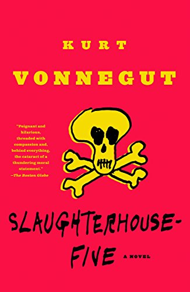

# Overview {.tabset .tabset_pills}

This report performs a text analysis of Slaughterhouse Five by Kurt Vonnegut. The PDF text is wrangled to gather the top 100 words used in the book and display them in a word cloud. A sentiment analysis is then performed using the afinn lexicon.



**Source:** Vonnegut, K. (1969). Slaughterhouse-five. Delacorte.
PDF accessed from : https://antilogicalism.com/wp-content/uploads/2018/04/slaughterhouse-five.pdf

```{r setup, include=FALSE, message=FALSE, warning=FALSE}
knitr::opts_chunk$set(echo = TRUE, message = FALSE, warning = FALSE)
library(tidyverse)
library(tidytext)
library(textdata)
library(pdftools)
library(ggwordcloud)
library(here)
library(stringr)
```

```{r}
shouse_five <- pdf_text(here("data/shouse_five.pdf"))
```

## Most common words in Slaughterhouse Five

```{r}
##Get text into a dataframe and tokenize
shouse_lines <- data.frame(shouse_five) %>% 
  mutate(page = 1:n()) %>%
  mutate(text_full = str_split(shouse_five, pattern = '\n')) %>% 
  unnest(text_full) %>% 
  mutate(text_full = str_trim(text_full))

## adding chapter info to the data frame
shouse_chapts <- shouse_lines %>% 
  slice(-(1:75)) %>% ## removing pages before chapter 1
  mutate(chapter = ifelse(str_detect(text_full, "^\\w+$") & !str_trim(text_full) %in% c("COURAGE"), text_full, NA)) %>% 
  fill(chapter, .direction = 'down') %>% 
  mutate(chapter = case_when(
    chapter == "One" ~ 1,
    chapter == "Two" ~ 2,
    chapter == "Three" ~ 3,
    chapter == "Four" ~ 4,
    chapter == "Five" ~ 5,
    chapter == "Six" ~ 6,
    chapter == "Seven" ~ 7,
    chapter == "Eight" ~ 8,
    chapter == "Nine" ~ 9,
    chapter == "Ten" ~ 10
  ))

## getting tokens into words
shouse_words <- shouse_chapts %>% 
  unnest_tokens(word, text_full, token = 'words')

## removing stop words
shouse_words_clean <- shouse_words %>% 
  anti_join(stop_words, by = 'word')

## getting total counts of all words in the book
non_stop_counts <- shouse_words_clean %>% 
  count(word)

## getting total counts of top 5 words by chapter
non_stop_counts_chapts <- shouse_words_clean %>% 
  count(chapter, word)

## Find the top 100 words from the book
top_100_words <- non_stop_counts %>% 
  slice_max(order_by = n, n = 100)
```

### Top 5 words in each Chapter

```{r}
## Find the top 20 words from the book
top_5_words <- non_stop_counts_chapts %>% 
  group_by(chapter) %>% 
  slice_max(order_by = n, n = 5)

ggplot(data = top_5_words, aes(x = n, y = word)) +
  geom_col(fill = "firebrick4") +
  facet_wrap(~chapter, scales = "free") +
  labs(x = "Chapter", y= "Word") +
  theme_minimal()
```

**Figure 1** displays the total number of occurrences of the top 5 most common words in each chapter of Slaughterhouse Five. In chapters where 2 or more words were tied for a place in the top 5, all tied words are shown.

### Word cloud of top 100 words in the entire book

```{r}
top100_cloud <- ggplot(data = top_100_words, aes(label = word)) +
  geom_text_wordcloud(aes(color = n, size = n), shape = 'diamond') +
  scale_size_area(max_size = 12) +
  scale_color_gradientn(colors = c('navy', 'goldenrod4', 'firebrick'))

top100_cloud
```

**Figure 2** shows a word cloud of the 100 most common words throughout the entire book 

## Sentiment analysis

### Afinn counts by chapter 

```{r}
afinn_lex <- get_sentiments(lexicon = "afinn")

shouse_afinn <- shouse_words_clean %>% 
  inner_join(afinn_lex, by = 'word')

afinn_counts <- shouse_afinn %>% 
  group_by(chapter, value) %>% 
  summarize(n = n())

ggplot(afinn_counts, aes(x = value, y = n)) +
  geom_col(fill = "goldenrod4") +
  facet_wrap(~chapter) +
  labs(x = "Afinn value", y = "Word count")
```

**Figure 3** shows the total word counts of each afinn value by chapter in Slaughterhouse Five 

### Mean afinn value by chapter

```{r}
afinn_means <- shouse_afinn %>% 
  group_by(chapter) %>% 
  summarize(mean_afinn = mean(value))

ggplot(data = afinn_means,
       aes(x = mean_afinn, y = fct_rev(factor(chapter)))) +
  geom_col(fill = "salmon4") +
  labs(x = "Mean afinn value", y = 'Chapter')
```

**Figure 4** displays the mean afinn sentiment of all words in each chapter